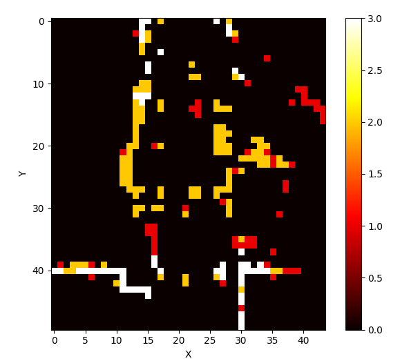
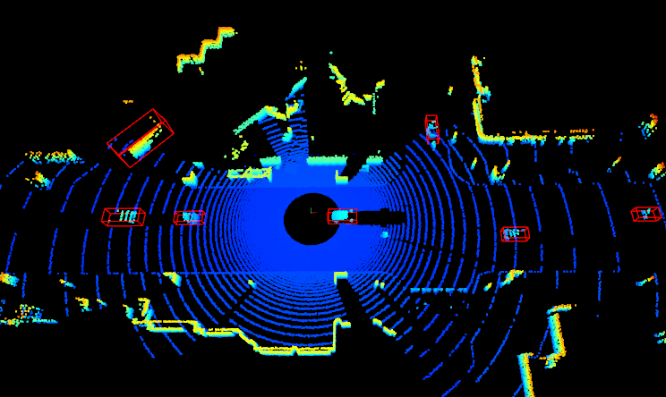

# Carla Dataset Tools (Active Collecting Integrated)

Data collection tools with active data acquisition strategy implemented for CARLA Simulator.

## Current work

1. PCD-BEV Heatmap
   
   

2. Lidar Label tool
   
   

3. Several Active Startegy
   
   - [x] Scene Entropy
   
   - [x] Temp Object tracking startegy
   
   - [ ] Distance-based Detecting startegy
   
   - [ ] Scene value calculation

## Installation

Download Carla version 0.9.14 [here](https://github.com/carla-simulator/carla).

### Environment

```shell
pip install carla==0.9.14
pip3 install -r requirements.txt

# Write following env into your bashrc or zshrc
export CARLA_ROOT=[PATH_TO_YOUR_CARLA]
export PYTHONPATH=$PYTHONPATH:$CARLA_ROOT/PythonAPI/carla/dist/[YOUR_CARLA_EGG_NAME]:$CARLA_ROOT/PythonAPI/carla/
```

## Usage

### Data Recording

Execute the command in the root directory:

```shell
python3 data_recorder.py
```

### Dataset Preparing

#### Image, lidar dataset

We support image data as **YOLO** format, lidar data as **OpenPCDet** format.

Execute the command in the root directory:

```shell
python format_helper.py -s {raw_data/record...}
```

#### Lidar Data Visualization

See more detail at [Visualize Doc](./doc/How to visulaize result?.md).

#### Apollo co-simulation

See more detail at [Co-sim](doc/run_apollo_carla.md).

## Data

Data can be collected by just executing `python3 data_recorder.py`. The configuration can be changed by modifying the files in the folder `config`.

| Dataset Name | Total Frames | Map    |
| ------------ | ------------ | ------ |
| D1           | 900          | Town02 |
| D1-S         | 579          | Town02 |
| D2           | 900          | Town02 |
| V            | 375          | Town03 |

## Result

| Dataset Name | Vehicle | Training Time | mAP   |
| ------------ | ------- | ------------- | ----- |
| D1           | 996     | 14min40s      | 0.508 |
| D1-S         | 996     | 11min32s      | 0.492 |
| D2           | 1835    | 16min07s      | 0.647 |

## Contributing

Thank you for your interest in contributing to this project! Contributions are highly appreciated and help improve the project for everyone. If you have any questions or need further assistance, please feel free to open an issue.

## Acknowledgments

- [CARLA Simulator](https://carla.org/)
- [CARLA Ros Bridge](https://github.com/carla-simulator/ros-bridge)
- [CARLA_INVS](https://github.com/zijianzhang/CARLA_INVS)
- [OpenPCDet](https://github.com/open-mmlab/OpenPCDet)
- [Patchwork++](https://github.com/url-kaist/patchwork-plusplus)

## Citation

```
@article{Lai2023ActiveDA,
 title={Active Data Acquisition in Autonomous Driving Simulation},
 author={Jianyu Lai and Zexuan Jia and Boao Li},
 journal={ArXiv},
 year={2023},
 volume={abs/2306.13923}
}
```

## Future Work

To validate the correctness of the strategy, we'd better try multiple algorithms:

- [x] YOLO
- [x] CenterPoint
- [ ] [Potential Field Based Active Startegy](https://zhuanlan.zhihu.com/p/144816424)
- [ ] More model
